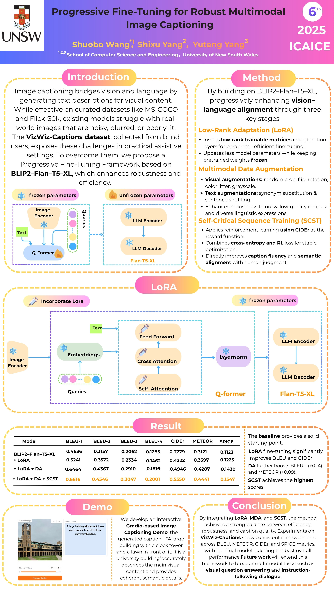
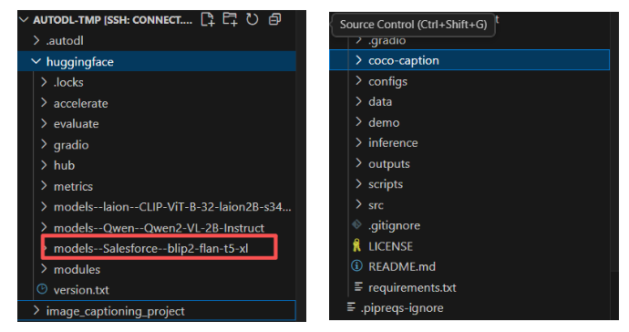

# Progressive Fine-Tuning for Robust Multimodal      							Image Captioning

​				**IEEE International Conference on Artificial Intelligence and Computer Engineering (ICAICE 2025)**

## Introduction

The paper introduces a progressive fine-tuning framework based on BLIP2–Flan–T5–XL. The framework consists of three stages that gradually enhance visual-language alignment while maintaining computational efficiency: (1) **Low-Rank Adaptation (LoRA)** for parameter-efficient domain adaptation, (2) **multimodal data augmentation** to improve robustness against visual and linguistic noise, and (3) **Self-Critical Sequence Training (SCST)** to directly optimize caption quality using CIDEr as the reward metric.
		 Below is the academic **poster** associated with our paper.

## Installation

### Download

```
git clone https://github.com/BoPythonAI/Image_captioning_project.git
cd Image_captioning_project
```

### Environment

```python
conda create -n image_captioning_project python=3.10.8
conda activate image_captioning_project
conda install pip
pip install -r requirements.txt
```

## Usage

#### At the beginning

 you are supposed to download the pre-trained  model BLIP2–Flan–T5–XL and coco-caption, and place them into the corresponding directories shown in the image



```
#!/bin/bash
git clone https://github.com/tylin/coco-caption.git
pip install cython pycocotools
echo "COCO caption toolkit installed ✅"
```

```
python -c "from transformers import Blip2ForConditionalGeneration; Blip2ForConditionalGeneration.from_pretrained('Salesforce/blip2-flan-t5-xl')"
```

For training, We have included the training samples for progressive fine-tuning in the corresponding **src** directory.
Configure training with configs/accel_no_ds.yaml. For inference and Evaluation, we can use  We can use the eval_utils.py and inference_blip2.py files in the inference directory.

## Demo

 We also developed an interactive Gradio-based Image Captioning Demo, which you can use the demo_gradio.py in the demo directory.


​	         

